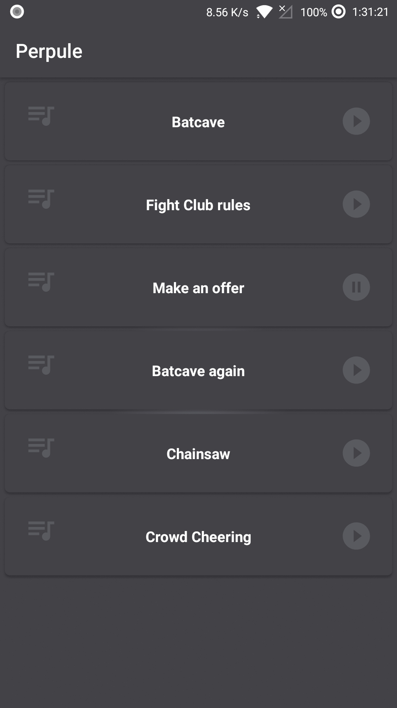

# Perpule-Android-Assignment
Check List : 

- [x] OOP concept

- [x] MVP design pattern

- [x] Retrofit adapter with RxJava

- [x] Unit tests

- [x] Animations and UI feel

- [x] Use a service.

- [ ] Offline Support

# ScreenShots

  
  
  

